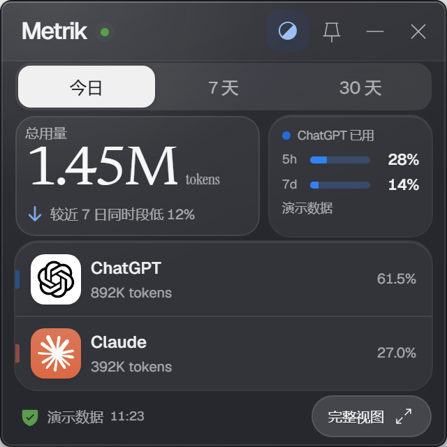
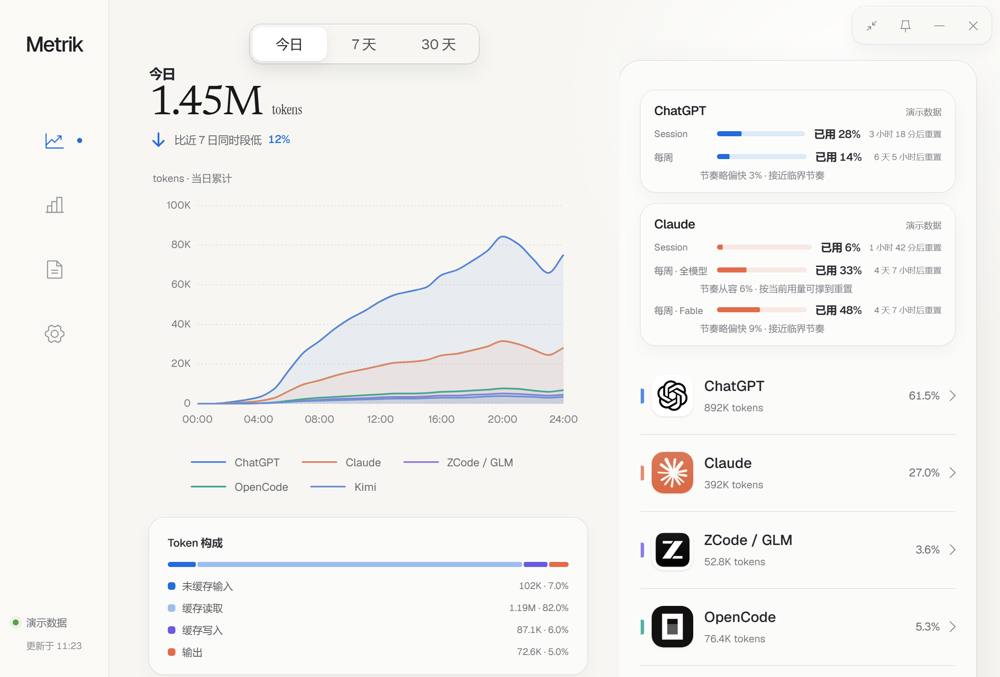
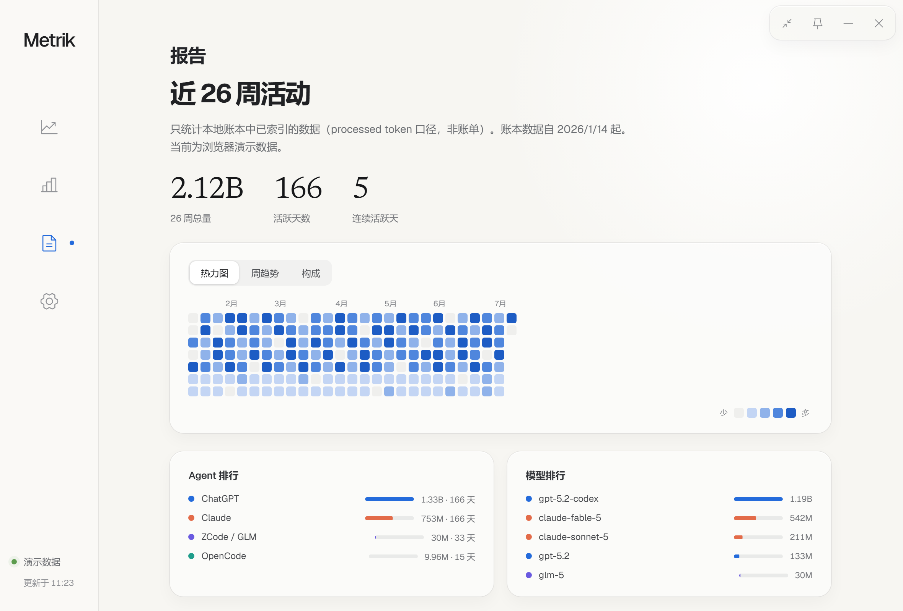
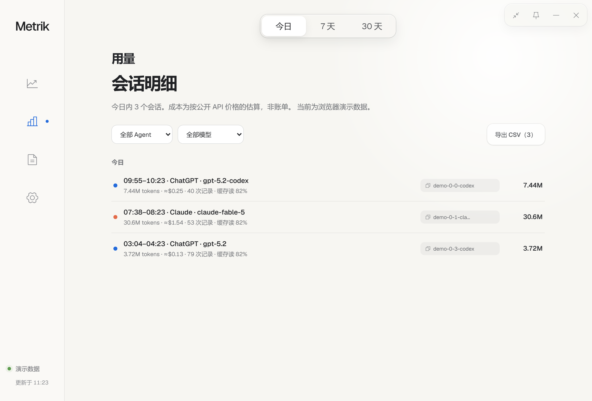
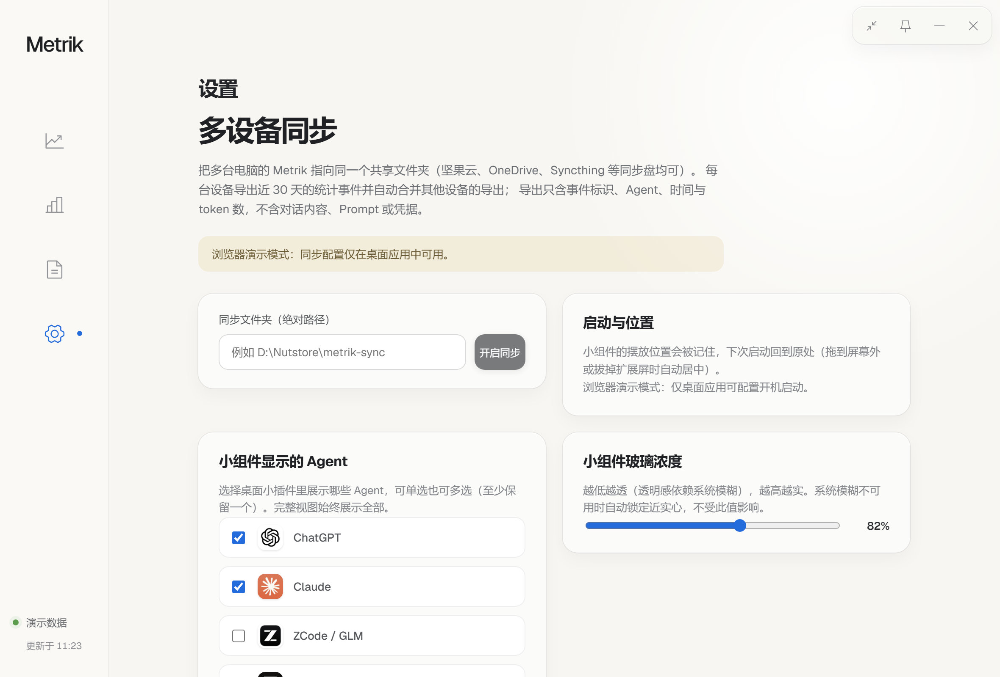

# Metrik

Metrik 是一个本地优先的 AI Agent 用量统计桌面应用。它读取本机 Agent 留下的日志，把**官方配额**、**本地解析的 Token**、**按公开价目估算的成本**三类事实分开呈现——估算永远不冒充账单，读不到就显示"不可用"，绝不用零值或演示数字顶替。

默认形态是 320 × 320 的桌面小组件，一键展开为完整统计视图。

[](LICENSE)
[](https://tauri.app/)
[](#当前验收边界)

<p align="center">
  
</p>



> 截图为浏览器演示数据，不是真实用量。

## 支持的 Agent

| Agent | Token 来源 | 官方配额 |
| --- | --- | --- |
| ChatGPT / Codex | `~/.codex/sessions` 的会话日志 | ✅ 本机 `codex app-server` |
| Claude | `~/.claude/projects` 的会话日志 | ✅ statusLine 钩子（零凭据）或 OAuth 直连（需显式开启） |
| ZCode / 智谱 GLM | `~/.zcode/cli/db/db.sqlite` 的 `model_usage` 表 | — |
| OpenCode | `~/.local/share/opencode/storage` | — |
| Kimi | `~/.kimi-code` 与 `~/.kimi` 的 `wire.jsonl` | — |

Gemini CLI 明确不在支持范围。Cursor 与 Antigravity 见[路线](#路线)。

## 主要功能

- **桌面小组件**：深色 HUD 玻璃（浓度可调），显示总用量与你选定的 Agent；固定后锁在原位，位置跨重启记忆；拖到屏幕上缘可挂靠自动收起。
- **配额三行元语**：窗口名 → 进度条 → 已用百分比 + 重置倒计时，外加消耗节奏预测（按当前速度能否撑到重置）。数据陈旧或窗口已重置时显式标注，不显示过期数字。
- **报告**：26 周热力图 / 周趋势折线 / Agent 构成环形，可切换。
- **用量**：按天分组的会话明细流，支持 Agent 与模型筛选、CSV 导出、一键复制会话 ID（方便 resume）。
- **成本估算**：静态价目表按 Token 分量计价。**没有价目的模型如实归入"未计价"，不猜**。
- **多设备同步**：指向一个共享文件夹（坚果云 / OneDrive / Syncthing 均可），各设备导出近 30 天的统计事件并自动合并。
- 托盘常驻、可选开机启动、单实例运行。

<details>
<summary>更多截图（报告 / 用量 / 设置）</summary>





</details>

## 数据口径

首页的数字是**处理量**：`未缓存输入 + 缓存读取 + 缓存写入 + 输出`。推理 token 是输出的子项，不重复叠加。**它不是账单金额。**

三类事实永远分开：

| 类型 | 含义 |
| --- | --- |
| 官方配额 | Agent 官方推送的窗口用量百分比与重置时间 |
| 本地 Token | 从本机日志逐事件解析、去重后的处理量 |
| 估算成本 | 按公开 API 价目对本地 Token 的折算，**不是你的账单** |

解析中遇到坏行或读取异常，对应来源会降级为"部分覆盖"，而不是继续伪装成精确结果。

## 不做什么

- **不猜数字。** 读不到就显示"不可用"；模型没有价目就归入"未计价"；配额窗口已重置而新数据未到，显示 `--` 而不是旧百分比。
- **不存对话内容。** 数据库只保存时间、Agent、模型、会话标识和源文件定位。不存 Prompt、回复正文、工具输出、凭据或原始文件内容。
- **不上传。** 本地优先。多设备同步只经由你自己指定的文件夹，导出内容仅含统计字段。
- **不默认碰凭据。** Claude 官方额度的默认来源是零凭据的 statusLine 钩子。OAuth 直连是可选项，默认关闭，开启前会告知条款风险（见下）。

## Claude 额度的两种来源

1. **statusLine 钩子**（推荐，默认）：Claude Code 本身会把官方额度推给状态栏脚本，钩子只提取额度数字落地成本地文件。零网络请求、零凭据。已有自定义 statusLine 时会**自动串联**——你原来的状态栏照常显示，额度追加在行尾，卸载时原样恢复。
   局限：只有在终端里渲染出状态栏的交互式会话才会刷新。你若主要在 IDE 或网页里用 Claude，额度会停更。

2. **OAuth 直连**（可选，默认关闭）：读取 Claude Code 已保存的登录凭据，直接查询官方额度接口，覆盖网页版消耗。
   ⚠️ **条款风险**：Anthropic 2026 年 2 月更新的消费者条款禁止在第三方工具中使用 Claude 订阅的 OAuth 凭据。目前公开的封禁集中在借订阅做推理的工具，未见只读用量查询被封号的案例，但按条款字面本功能同样属于违规范围。**不愿承担风险请保持关闭。**

## 本地运行

要求 Node.js 22+、Rust 1.88+。

```bash
npm install
npm run desktop:dev    # 桌面开发模式（读取真实本机日志）
npm run dev            # 仅浏览器预览（演示数据，显式标注）
npm run desktop:build  # 构建安装包
```

## 验证

```bash
npm run build
cd src-tauri
cargo test                    # 96 项通过，2 项真实环境烟测默认忽略
cargo clippy -- -D warnings
cargo fmt --check
```

读取当前机器真实日志的烟测需手动运行：

```bash
cargo test live_snapshot_smoke_test -- --ignored --nocapture
```

## 当前验收边界

- 仅在 **Windows 10/11 x64** 实机构建与验收。macOS、Linux 共用同一套 Tauri/Rust 代码，但没有对应产物和实机结论。
- **Kimi 适配尚未实机验收**：格式依据官方 wire 协议文档与既有工具核实、并有测试夹具覆盖，但作者本机未安装 Kimi。装了 Kimi 的用户请核对数字，发现偏差欢迎提 issue。
- 安装包未数字签名，Windows 可能提示"未知发布者"。目标机未安装 WebView2 时，默认安装器需要联网获取运行时。
- Token 统计来自本地日志而非官方账单。来源页显示"部分覆盖"时，总量只包含成功解析的记录。
- 持续增长的大型日志目前仍需整文件重扫；首次索引期间可能出现明显 CPU 与磁盘占用。

## 路线

1. 真正的追加游标（避免大日志整文件重扫）
2. macOS / Linux 构建与实机验收
3. 端到端加密的中继同步（当前为共享文件夹方案）
4. **Antigravity**：token 数据只存在于本机 language server 的私有 RPC 后面（需 IDE 常驻），模型名是随版本变化的占位符别名，且现有参考实现均不支持 Windows。在拿到真机上的确切响应之前不接入——照文档猜着写只会产出看起来对、实际错的数字。
5. **Cursor**：依赖云端 API + 本地凭据提取，需要先设计显式的凭据授权机制。

架构与去重逻辑见 [docs/ARCHITECTURE.md](docs/ARCHITECTURE.md)，视觉对照见 [design-qa.md](design-qa.md)，Windows 验收证据见 [ACCEPTANCE.md](ACCEPTANCE.md)。

## License

[MIT](LICENSE)
