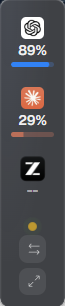

# Metrik

把 Codex、Claude 等 AI Agent 的用量放到一个桌面小组件里。

> **English:** Metrik is a local-first desktop usage tracker for Codex, Claude, and other AI coding agents. It brings official quota status, locally parsed token usage, estimated costs, trends, and session details into one view without mixing them together. Windows users can keep it as a desktop widget or compact quota strip, while macOS users can access it from the menu bar. In a Windows Task Manager snapshot taken while idle, Metrik used about 20.6 MB of memory; actual usage varies by system and log size. Usage data stays on your device by default, and optional multi-device sync uses a OneDrive, Nutstore, or Syncthing folder you choose without passing data through a Metrik server.

Metrik 读取本机日志，同时展示三类数据：

- **官方配额**：已用比例和重置时间
- **本地 Token**：从会话日志解析出的处理量
- **估算成本**：按公开 API 价格换算，仅供参考

这三类数据分开计算。读取失败时会显示“不可用”或“部分覆盖”，不会用演示数字补位。

[](https://github.com/keros68/metrik/releases/latest)
[](LICENSE)
[](https://tauri.app/)
[](#安装与限制)

[下载最新版](https://github.com/keros68/metrik/releases/latest)：Windows `.exe` / macOS `.dmg`（通用包）。安装包暂未签名，首次运行需要手动放行。

<p align="center">
  
</p>

<p align="center">
  
  &nbsp;&nbsp;&nbsp;
  
</p>
<p align="center"><sub>Windows 小组件可折叠成横向或竖向配额条。</sub></p>


> 截图使用浏览器演示数据，不代表真实用量。

<details>
<summary>查看报告、用量和设置页面</summary>


</details>

## Metrik 的侧重点

同类工具里，有的主要做 macOS 菜单栏配额，有的主要做终端 Token 报表。Metrik 不追求支持数量最多，当前更关注这几件事：

- **Windows 和 macOS 都有桌面入口**：Windows 提供小组件与横竖配额条，macOS 提供菜单栏面板。
- **空闲常驻占用较小**：一次 Windows 任务管理器截图中，Metrik 显示约 20.6 MB 内存和 0% CPU；实际占用会随日志规模、索引状态和系统环境变化。
- **三类数据不混用**：官方配额、本地 Token、估算成本分别标注来源和状态。
- **既看当前配额，也看历史用量**：同一应用里保留趋势、热力图、会话和 Token 构成。
- **多设备不依赖 Metrik 服务器**：通过你自己的 OneDrive、坚果云或 Syncthing 文件夹合并统计事件。
- **默认少碰凭据**：本地 Token 来自日志；Claude 配额默认使用 statusLine 钩子，OAuth 直连需要手动开启。

## 主要功能

- **桌面速览**：Windows 使用 320 × 320 小组件或配额条，macOS 使用菜单栏面板。
- **完整统计**：查看趋势、26 周热力图、Agent 构成和 Token 构成。
- **会话明细**：按天筛选会话，导出 CSV，复制会话 ID 用于继续会话。
- **成本估算**：按 Token 类型和公开价目计算；没有价格的模型单独标记为“未计价”。
- **多设备合并**：通过你指定的 OneDrive、坚果云或 Syncthing 文件夹合并近 30 天统计事件。
- **桌面能力**：托盘常驻、可选开机启动、单实例运行，以及手动检查更新。

## 支持的 Agent

| Agent | Token 来源 | 官方配额 |
| --- | --- | --- |
| ChatGPT / Codex | `~/.codex/sessions` | ✅ 本机 `codex app-server` |
| Claude | `~/.claude/projects` | ✅ statusLine 钩子；可选 OAuth 直连 |
| ZCode / 智谱 GLM | `~/.zcode/cli/db/db.sqlite` | — |
| OpenCode | `~/.local/share/opencode/storage` | — |
| Kimi | `~/.kimi-code` 与 `~/.kimi` | — |
| Antigravity | 本机 language server 实时 RPC（IDE 需运行） | ✅ RPC 官方配额 |

Gemini CLI 不在支持范围内。Cursor 仍在评估中。

## 数据与隐私

首页的 Token 是处理量：`未缓存输入 + 缓存读取 + 缓存写入 + 输出`。推理 Token 已包含在输出中，不会重复叠加；这个数字也不是账单金额。

Metrik 的本地数据库只保存统计字段和源文件定位，不保存 Prompt、回复正文、工具输出、凭据或原始文件内容。数据不会上传到 Metrik 的服务器；多设备功能只读写你指定的共享文件夹。

除用户主动开启的 Claude OAuth 查询外，应用只会在你手动检查更新时发起网络请求。更新包会经过 minisign 校验。

<details>
<summary>Claude 官方配额的两种读取方式</summary>

**statusLine 钩子（默认）**：读取 Claude Code 传给状态栏脚本的配额信息，不使用凭据。只有终端中的交互式 Claude Code 会话渲染状态栏时才会刷新。

**OAuth 直连（可选，默认关闭）**：读取 Claude Code 已保存的登录凭据，查询账户配额，能够覆盖网页版消耗。

Anthropic 当前的[消费者条款](https://www.anthropic.com/legal/consumer-terms)限制通过非 API 的自动化方式访问其服务，除非 Anthropic 明确允许。Metrik 的 OAuth 直连可能落入这一限制，请自行评估后再开启。

</details>

## 安装与限制

- 已提供 Windows 10/11 x64 和 macOS Apple Silicon 安装包；Linux 暂无发布包。
- v0.6.4 的 Windows 安装包约 3.3 MB，macOS 通用 DMG 约 8.4 MB。
- 安装包尚未购买代码签名证书，首次运行会触发系统提示；Release 页面提供 SHA256。
- Kimi 与 Antigravity 有测试夹具，但作者尚未在真机上验收。Antigravity 还要求 IDE 正在运行。
- 大型日志首次索引会占用一段 CPU 和磁盘；索引在后台执行，未完成时会标记为不完整。
- 从 v0.1.0 升级需要手动下载一次新版，之后才能使用应用内更新。

更完整的验证范围见 [ACCEPTANCE.md](ACCEPTANCE.md)。

## 开发

要求 Node.js 22+、Rust 1.88+。

```bash
npm install
npm run desktop:dev    # 桌面开发模式，读取真实本机日志
npm run dev            # 浏览器预览，使用演示数据
npm run desktop:build  # 构建安装包

npm run build
cd src-tauri && cargo test && cargo clippy -- -D warnings && cargo fmt --check
```

架构与去重逻辑见 [docs/ARCHITECTURE.md](docs/ARCHITECTURE.md)，视觉验收见 [design-qa.md](design-qa.md)。

## Roadmap

1. 使用追加游标读取持续增长的大型日志
2. 提供 Linux 构建
3. 增加端到端加密的中继同步
4. 在明确授权机制后评估 Cursor 支持

## License

[MIT](LICENSE)
