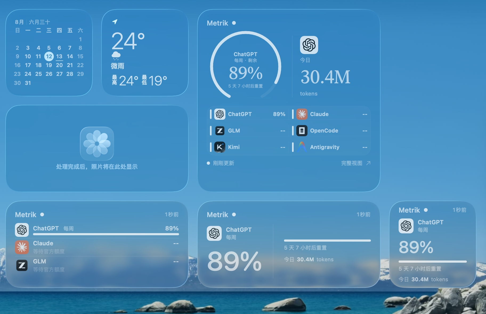
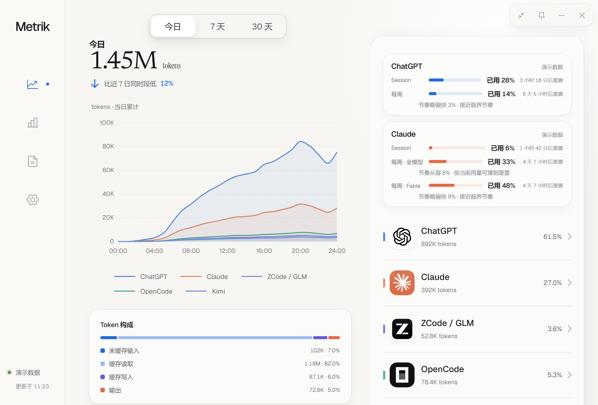
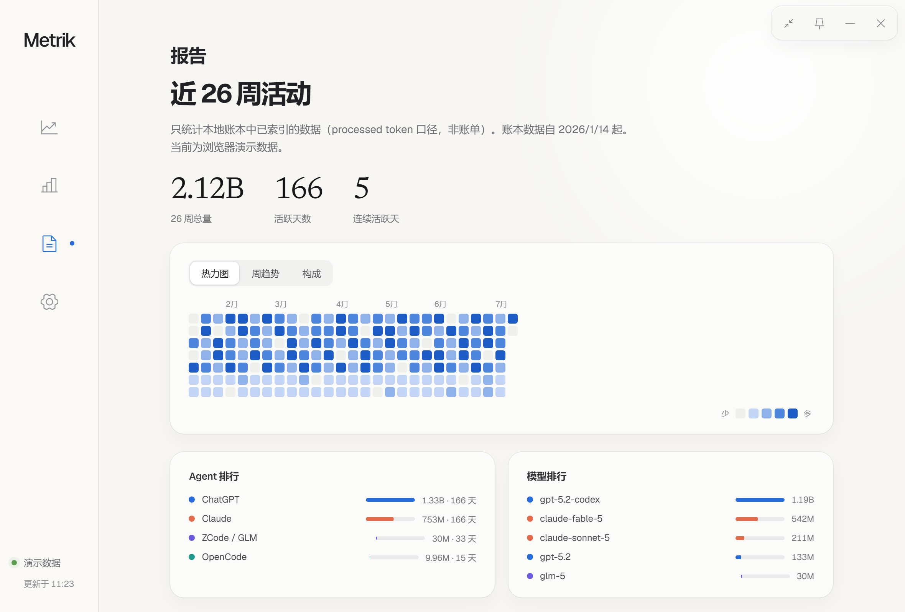
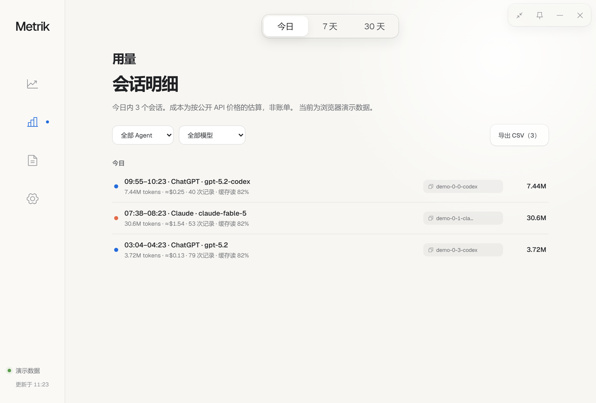
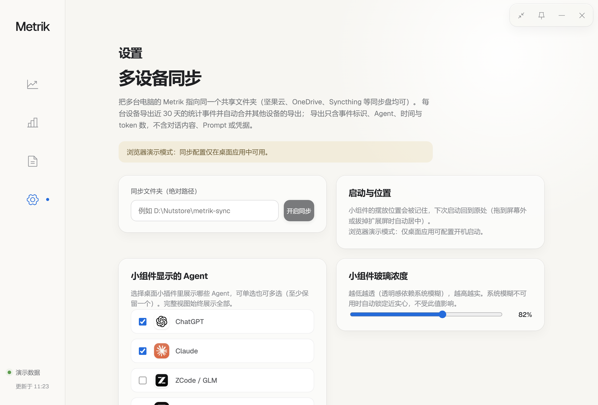

# Metrik 使用说明

## 下载与安装

[打开最新版本下载页](https://github.com/keros68/metrik/releases/latest)，按系统选择：

| 系统 | 推荐文件 |
| --- | --- |
| Windows x64 | `Metrik_*_x64-setup.exe` |
| macOS | `Metrik_*_universal.dmg` |
| Ubuntu 24.04 x86_64 | `Metrik_*_amd64.deb`，或免安装的 `AppImage` |

安装包尚未加入 Windows / Apple 商业代码签名，首次运行需按系统提示手动放行。Release 页提供 SHA256 校验值。

## 截图

<p align="center">
  
</p>

<p align="center"><sub>Windows 实机截图，玻璃外观取透明档。</sub></p>

<p align="center">
  
</p>

<p align="center"><sub>macOS 实机截图，原生 WidgetKit 桌面小组件。</sub></p>



> 完整视图截图使用浏览器演示数据，非真实用量。

<details>
<summary>更多截图（报告 / 用量 / 设置）</summary>





</details>

## 平台支持

- Windows：320 × 320 桌面小组件，可收缩为横向或纵向配额胶囊条；支持深色 / 浅色 / 透明三档玻璃材质、0.75–2.0 缩放、边缘自动隐藏与置顶常驻。
- macOS：菜单栏状态项与面板、原生 WidgetKit 桌面小组件，点击菜单栏项目可展开完整统计页面。
- Ubuntu 24.04 x86_64：紧凑卡片、贴合内容的横向 / 纵向配额胶囊条、完整统计视图与系统托盘；组件使用 CSS 玻璃回退。X11 会话支持按形态记忆位置与边缘自动隐藏；Wayland 下由桌面合成器管理窗口位置。置顶后控件全部失活，鼠标进入时可按设置立即降低透明度或完全隐藏；从托盘打开设置后才能取消置顶。

## 核心功能

1. **配额卡片**：各 Agent 剩余额度、进度、重置倒计时与消耗节奏预估。主数值取余量最低的窗口，日常是 5 小时，更长周期的窗口告急时改取该窗口。
2. **配额胶囊条（Windows / Ubuntu）**：收缩成一根横条或竖条，每格只有图标与剩余占比，固定、横竖切换、还原这些按钮平时收起，点「…」就地展开；展示哪些 Agent、按什么排序可配置，卡片与胶囊条各自独立。
3. **统计与报表**：26 周热力图、周趋势折线、Agent 占比环形图、项目走势；用量页以项目为主视图（占比环形 + 排名列表），点击项目进入该项目的会话明细，项目总表与会话明细都可导出 CSV。项目按各 Agent 记录的工作目录归集，默认向上合并到 git 仓库根，也可手动登记项目根或隐藏目录；读不到目录的用量单独列出。完整面板分概览、用量、报告、设置四页，主题可跟随系统或手动指定。
4. **多设备同步**：指定共享文件夹（坚果云 / OneDrive / Syncthing 均可），各设备导出近 30 天统计事件并自动合并，无云端服务。
5. **系统能力**：托盘常驻、可选开机自启、单实例运行。更新检查默认开启，启动后检查一次，持续运行时每天检查一次，可在设置中关闭；这是本应用唯一主动发起的网络请求。下载与安装仍由用户确认，更新包经 minisign 校验，签名不符拒绝安装。

## 数据说明

1. 官方配额：Agent 官方接口给出的窗口剩余占比与重置时间。
2. 本地 Token：解析本机日志逐事件去重后的处理量，含未缓存输入、缓存读写与输出；推理 token 属输出子项，不重复计入。解析不全时标注「数据不完整」。
3. 估算成本：按公开 API 价目折算的参考值，不等同官方账单。无价目的模型标记「未计价」，取不到的数值显示 `--`。

后台派发工具（aicross 等）常把会话跑在系统临时目录的 scratchpad 里：这部分用量照常入账，但项目列表按内置规则不展示临时目录，只在用量页以「未计入项目」计数呈现。若想下钻这些会话，在项目规则中把 scratchpad 的上级目录（如 `%TEMP%\claude`）登记为项目根即可，登记根优先于内置隐藏，立即生效、无需重扫。

## 隐私

数据库只存时间、Agent、模型、会话标识、项目工作目录与源文件路径，不写入提示词、回复正文、工具输出与凭据。项目目录只留在本机，多设备同步不导出。

同步仅依赖用户指定的共享目录，项目不提供云端服务。查询配额时只读取各 Agent 已存于本机且为明文的凭据（环境变量、OpenCode `auth.json`、zcode `v2/config.json` 等），设备绑定加密的凭据不解密，也不为此开启本地端口。

## Claude 配额的两种读取方式

1. **状态栏钩子（默认）**：Claude Code 把配额推送至状态栏脚本，Metrik 从本地文件提取数值，不发网络请求、不使用凭据。已有自定义脚本会自动串联，卸载时恢复原状。限制是仅交互式终端会话会刷新，主要在 IDE 或网页端用 Claude 时配额不更新。
2. **OAuth 直连（可选，默认关闭）**：读取 Claude Code 已保存的登录凭据直查官方接口，可覆盖网页端消耗。风险：Anthropic 2026 年 2 月的消费者条款禁止第三方工具使用订阅 OAuth 凭据，目前封禁案例集中于借订阅做推理的工具，未见只读用量查询被封，但按条款字面本功能同属违规范围，是否开启需自行判断。

## 命令行读取额度

供脚本、桌面小组件等外部工具读取已落库的官方额度（只读，不扫描日志、不发网络请求、不使用凭据）：

```bash
metrik --quota-json            # 读取默认位置的账本
metrik --quota-json <db-path>  # 显式指定账本路径
```

输出带 `schemaVersion` 的 JSON：每个 Agent 一个条目，窗口含 `remainingPercent`、`resetsInMinutes`、`stale`、`resetExpired`、`quality`。注意 `kind: "balance"` 的窗口（如 DeepSeek）存的是账户余额金额而非百分比。账本不存在或无法读取时输出走 stderr、退出码非 0。字段随版本演进，消费方应按 `schemaVersion` 解析。

## 已知限制

1. 安装包未做数字签名，首次运行需手动放行；Windows 未预装 WebView2 时安装程序需联网获取运行时。
2. Linux 仅覆盖 Ubuntu 24.04 x86_64，其它发行版与架构尚未验证，需自行构建。AppImage 若无法显示托盘，请确认桌面环境已启用 StatusNotifier/AppIndicator 支持。
3. Antigravity 需对应 IDE 处于运行状态才有数据。
4. 首次索引大体量日志会占用一段 CPU 与磁盘，界面可正常操作，未覆盖完整历史的数值会标注说明。
